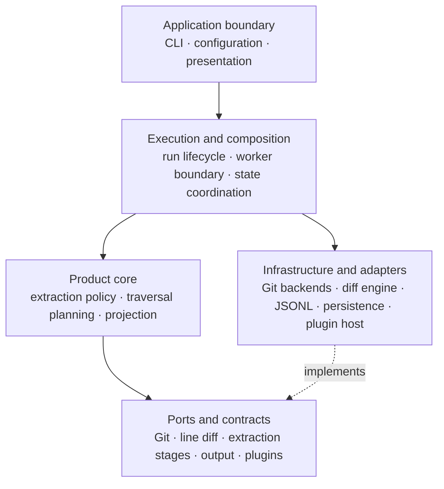

# gitlode Architecture

## Purpose and scope

This document is the canonical software architecture design for gitlode. It describes the logical
layers, runtime boundaries, dependency direction, execution flow, and durable design trade-offs.
These concepts should remain valid when source domains move or repository packages are reorganized.

The physical implementation structure is documented separately:

- [`domain-design.md`](domain-design.md) defines domain charters, package ownership, allowed
  dependencies, import boundaries, and their enforcement.
- [`../contributing/build-test-release.md`](../contributing/build-test-release.md) defines the
  TypeScript build graph, development workflow, release bundling, and validation commands.

Specialized design documents describe individual capabilities in more detail and are linked from
the relevant sections below. Agent-specific entrypoints may summarize or route to this document,
but they must not replace it as the durable architecture source of truth.

## Product context

### What gitlode is for

gitlode is an ETL bridge between Git repositories and analytical systems such as data warehouses,
BI tools, and metrics pipelines. It converts Git's graph-structured commit history into a flat,
streaming-friendly format that analytical systems can ingest without understanding Git internals.

The analytical value gitlode targets is aggregation: grouping and counting commit events across
dimensions such as author, time period, or changed file area. Two broad categories motivate
extraction:

- **People dimension**: developer activity patterns, authorship, commit frequency, team velocity,
  and collaboration signals.
- **Product dimension**: release cadence, codebase evolution, branch lifecycle, technical-debt
  indicators, and change velocity by area.

gitlode is responsible for faithful extraction. Interpretation—deriving metrics, aggregations, or
insights from the data—belongs to downstream systems.

Output fields act as either aggregation axes (who, when, or what area) or quantitative measures
(how many or how much). Base output grains should prefer entities that are Git-native and
analytically stable across repositories and tooling choices. Finer-grained structures derived from
diff presentation are better treated as derived signals or pipeline enrichments unless they form a
broadly reusable axis-and-measure pair.

This is also an extensibility principle: gitlode exposes canonical Git facts, while
organization-specific interpretation and enrichment attach at the pipeline boundary rather than
becoming part of the extraction core.

### What gitlode is not for

Individual history inspection—such as finding which commits touched a file or who last changed a
line—is already served well by Git clients and IDEs. If an analysis can be answered efficiently
with `git log` or a standard Git GUI, it is not a target use case for gitlode.

### When incremental extraction matters

Snapshot extraction is sufficient for one-time analyses or small repositories. Incremental
extraction becomes important when repositories change continuously, full-history reprocessing is
too costly, or downstream ingestion is append-only or event-sourced. In those cases, state-backed
extraction provides a durable checkpoint between successful runs.

### Constraints inherited from Git

Several Git properties directly constrain gitlode's guarantees:

- **Output order is not chronological or otherwise stable.** Commit DAG traversal order can differ
  from timestamp order across merge branches. Consumers must sort by `committer.timestamp` when
  chronological order is required.
- **Commits carry no branch information.** A branch selects a traversal head; it is not an attribute
  stored in the commit object. The same commit may be reachable from multiple branches.
- **Branch refs are mutable.** Extracted data is a snapshot of reachability at extraction time, and
  later force-pushes can invalidate inferred branch attribution.

Within a single run, gitlode guarantees that every commit reachable from the requested refs and
within the requested range appears exactly once.

## Architectural principles

### Product policy depends on ports

Extraction policy depends on contracts for repository access, line-diff calculation, output, and
extension points. It does not depend on concrete Git backends or other infrastructure mechanics.
This keeps policy testable and allows implementations to evolve independently.

### Composition depends inward

Concrete implementations are selected and wired at the execution boundary. Lower layers neither
discover implementations nor depend back on orchestration. Contracts contain stable vocabulary and
ports; implementations depend on those contracts, never the reverse.

### Facts are separate from interpretation

Repository-native facts and built-in records belong to the extraction model. Optional,
organization-specific meaning is added through plugins after facts are extracted, rather than
being embedded in Git adapters or base extraction policy.

### Work is streamed

Commit traversal, fact production, projection, and output are streaming operations. The design
avoids retaining a repository's complete history in memory and accepts graph traversal order as the
corresponding trade-off.

### Persistence advances only after success

Checkpoint persistence is outside the extraction policy and occurs only after output completes
successfully. Versioned storage documents do not cross into the worker or extraction contracts;
those boundaries carry a version-independent checkpoint model.

## Logical architecture

gitlode is a Node.js CLI with five logical areas. These are responsibilities rather than package or
directory classifications; a physical domain may support part of a layer, and a layer may be
implemented by several domains.

The diagram shows dependency intent, not source ownership. The normative mapping to domains and
packages is in [`domain-design.md`](domain-design.md).

### Application boundary

The application boundary:

- parses and validates CLI input and configuration;
- resolves precedence and derived defaults;
- maps external input into execution-owned values;
- selects exit behavior and renders diagnostics, progress, summaries, and profiles; and
- keeps presentation types out of execution and product policy.

The process entrypoint is the composition point where execution results are explicitly mapped to
presentation data. Execution and presentation do not depend on one another.

### Execution and composition

Execution owns one run's lifecycle across the main process and worker boundary. It:

- coordinates state loading, worker dispatch, and successful state replacement;
- constructs concrete repository, line-diff, extraction, output, and plugin components;
- owns run-scoped resource disposal;
- transports presentation-independent diagnostics and progress; and
- translates worker failures into an application-level result.

Execution may know both contracts and concrete implementations because it is the composition
layer. That exception does not grant product domains the same dependency direction.

### Product core

The extraction core owns product policy. It:

- plans traversal for requested refs and incremental ranges;
- traverses and deduplicates commits within a run;
- applies date and exclusion policies without assuming chronological traversal;
- expands repository file facts and decides when line diff is applicable;
- projects canonical facts into records;
- coordinates the output sink lifecycle; and
- produces a version-independent checkpoint only after successful output completion.

For date filtering, old commits are skipped but traversal continues because commit graph order is
not chronological.

### Ports and contracts

Ports define the vocabulary exchanged across architecture boundaries:

- canonical commit and file-change facts and their projected records;
- extraction ranges, checkpoints, requests, results, and stage contracts;
- Git repository access and typed operational failures;
- line-based diff calculation;
- output sinks; and
- plugin initialization and projection contracts.

Contracts expose no concrete backend selection, plugin-host machinery, storage-document version,
or presentation policy.

### Infrastructure and adapters

Infrastructure implements ports and owns technology-specific behavior:

- Git backends resolve refs, traverse commits, and read object data;
- the generic DAG subsystem supplies Git-neutral traversal algorithms below the Git adapter;
- line-diff implementations calculate additions and deletions without owning extraction policy;
- output infrastructure serializes JSONL and rotates files;
- state infrastructure validates and atomically replaces versioned state documents; and
- the plugin host resolves modules, checks compatibility, initializes plugins, and decorates
  projection.

Git adapters yield repository-native file and blob facts. They do not infer rename semantics or
own line-diff eligibility. The extraction core owns size and binary guards before invoking the
line-diff port. Detailed Git implementation choices are documented in
[`git-adapters.md`](git-adapters.md).

## End-to-end runtime flow

1. The application boundary parses arguments, loads configuration, and resolves an invocation.
2. The process composition root creates presentation collaborators and maps the invocation to an
   execution request.
3. Execution loads prior state when configured and dispatches a worker request carrying only
   version-independent values.
4. Worker-side execution constructs concrete adapters, the extraction pipeline, output, and plugin
   runtime.
5. Plugins are loaded and initialized when configured, and their projector decorates the built-in
   projector.
6. For each requested ref, extraction resolves the head and exclusion boundary, traverses commits,
   deduplicates them, applies filters, expands facts when required, projects records, and streams
   them to the sink.
7. The worker returns progress, diagnostics, the extraction result, and profiling data to the main
   process.
8. After successful output completion, execution atomically persists the new checkpoint.
9. The process boundary maps the execution result to presentation data and determines the exit
   behavior.

## Cross-cutting concerns

### Diagnostics, progress, and presentation

Diagnostics and progress are presentation-independent values that may cross the worker boundary.
Lower layers report structured information but do not select terminal UI, formatting, or exit
behavior. Presentation owns rendering, and the application boundary performs explicit mappings
between execution and presentation models.

### Profiling and instrumentation

The accepted telemetry target uses OpenTelemetry API contracts directly. Instrumentation is
run-scoped and follows operation ownership: execution owns the total run observation, product stages
own their phase and work measurements, and concrete adapters report implementation work without
adding telemetry to stable product ports. High-frequency work uses metrics rather than creating a
span per commit, file, record, blob, or diff.

Worker-side execution owns SDK composition, active context, local collection, and finalization.
Profiling results cross the worker boundary only as an SDK-independent report. Presentation owns
labels, grouping, preferred reading order, and terminal formatting; collectors do not contain
pipeline-specific display knowledge.

`--profile` enables local collection of the normal observation catalog. It does not enable a
different extraction path or a detailed per-item span mode. Local profiling and a possible future
external destination are mutually exclusive; external export is not part of the current redesign.
The complete target contract and its implementation status are documented in
[`telemetry.md`](telemetry.md).

### Plugin extension boundary

Plugins attach at projection, after canonical facts have been extracted. The plugin host decorates
an injected base projector; it does not duplicate base projection or invoke plugins from Git or
output infrastructure. Initialization is a host responsibility and precedes extraction.

This placement preserves the base output model while allowing optional enrichment. The public
contract, compatibility behavior, and examples are documented in [`plugins.md`](plugins.md).

### Public and repository-internal boundaries

Logical architecture does not require repository domains to be independently published. Private
workspace packages enforce source ownership during development, while the public release presents
one `gitlode` runtime and its plugin API. The exact package topology belongs to
[`domain-design.md`](domain-design.md); build and bundling mechanics belong to
[`../contributing/build-test-release.md`](../contributing/build-test-release.md).

## Design decisions and trade-offs

### Adapter boundary over direct library calls

Depending on ports keeps extraction testable and limits the impact of replacing a Git or line-diff
implementation. The cost is explicit contract design, error translation, and adapter maintenance.

### Streaming traversal and writing

Streaming supports repositories with large histories without loading all commits into memory. The
trade-off is graph traversal order rather than chronological output order.

### State write after successful output only

Delaying checkpoint replacement prevents partial runs from advancing durable state. Failed runs
may consequently repeat already completed traversal on retry.

### Session-level deduplication

Deduplicating within one run prevents duplicates when requested refs share history. It does not by
itself eliminate duplicates across independent runs when reachability changes or new branches are
introduced.

### Worker isolation

Repository extraction runs behind a worker boundary so the main process retains ownership of
application lifecycle, presentation, and durable state coordination. This requires explicit,
serializable protocols and keeps storage-document and UI-specific types out of worker contracts.

### Private implementation packages

Repository packages make ownership and dependency direction enforceable without turning those
boundaries into public compatibility promises. The public release bundles private implementation
code, at the cost of maintaining distinct development and release build forms.

## Extensibility

The architecture deliberately leaves the following seams open:

- additional Git and line-diff implementations behind existing ports;
- additional output formats behind the output-sink boundary;
- organization-specific record enrichment through plugins;
- alternative cross-run deduplication and incremental-range policies; and
- changes to progress or presentation without coupling them to execution policy.

## Non-goals

- Chronological ordering guarantees in output line sequence.
- Global deduplication across independent runs.
- Branch metadata embedded into commit objects.
- Public compatibility guarantees for private repository packages.

## Related design documents

- [`domain-design.md`](domain-design.md) — domains, package topology, imports, and enforcement.
- [`git-adapters.md`](git-adapters.md) — Git backend selection and implementation boundaries.
- [`git-traversal.md`](git-traversal.md) — commit DAG traversal design.
- [`plugins.md`](plugins.md) — plugin contract and runtime behavior.
- [`telemetry.md`](telemetry.md) — OpenTelemetry-based instrumentation and local profiling design.
- [`cli.md`](cli.md) — CLI behavior and configuration boundary.
- [`schema.md`](schema.md) — output schema design.
- [`../contributing/build-test-release.md`](../contributing/build-test-release.md) — development,
  test, bundle, and release validation workflow.
