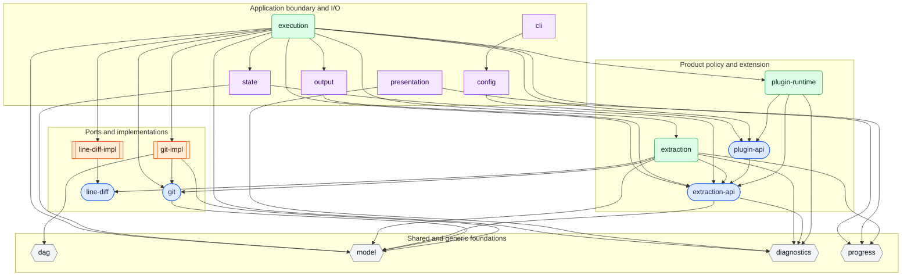
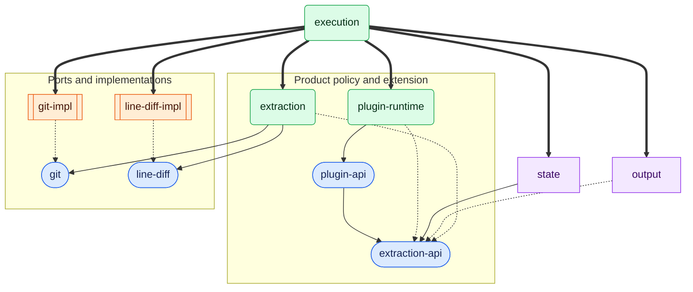

# Domain Design

## Purpose

This document defines how gitlode divides its source code into domains and packages and how those
units may depend on one another. Its purpose is to make future classification decisions repeatable:
adding, splitting, merging, moving, or renaming a domain should follow the same principles rather
than depend on an ad hoc judgment about the files involved at the time.

This document is the canonical source for domain charters, package ownership, dependency rules,
official package surfaces, source import boundaries, and architecture enforcement.
[`architecture.md`](architecture.md) describes the logical software architecture without making
the current domain or package arrangement part of that architecture. Build order, TypeScript
projects, release bundling, and validation commands are documented in
[`../contributing/build-test-release.md`](../contributing/build-test-release.md).

## 1. Domain Design Principles

### 1.1 Domain definition and charter

A domain is a set of modules governed by one architectural charter. The charter identifies:

- **Purpose:** the responsibility it owns.
- **Admissions and exclusions:** what may and may not belong.
- **Dependencies:** allowed and forbidden domains, runtime APIs, and external packages.
- **Runtime and lifecycle:** environment assumptions, side effects, resources, and disposal.
- **Stability:** whether it is a contract, product policy, internal mechanism, or implementation.

A domain must be defined before files are classified into it. Names and current contents are
evidence for discovering a charter, but they do not define one. A charter that is too broad to
exclude anything is not useful.

### 1.2 Cohesion and dependency scope

Domain design balances:

- **Cohesion:** code with the same responsibility and reasons to change should stay together.
- **Dependency scope:** consumers should not acquire unrelated implementations, runtime
  assumptions, side effects, or external dependencies.

A consumer accepts a domain's charter and dependency envelope, not every symbol it exports.
Different consumers may use different utilities from the same domain when all of those utilities
obey the same charter. Conversely, related responsibilities may require separate domains when their
dependency or runtime characteristics differ.

Code volume and the ability to imagine a finer taxonomy are not, by themselves, domain boundaries.
Growth in code volume may trigger a review of whether the domain still has a coherent charter and
dependency envelope. That review justifies a domain split only when it identifies a concrete
boundary to protect; otherwise, code volume may justify splitting modules within the existing
domain.

### 1.3 Dependencies and implementation boundaries

Domain analysis distinguishes:

- **Type dependencies**, which affect source and declarations but are erased from JavaScript.
- **Runtime dependencies**, which are loaded or invoked by JavaScript.
- **Implementation dependencies**, which select or construct a concrete implementation.
- **Environment dependencies**, such as Node.js, filesystems, workers, or executables.
- **External-package dependencies**, which add separately versioned libraries.

These dependency kinds may justify different domains even when responsibilities are closely
related.

Interfaces and implementations should be separated into different domains when doing so protects a
real boundary, for example when:

- a consumer needs the contract without a concrete implementation;
- multiple implementations exist or are expected;
- the implementation adds environment, package, side-effect, or lifecycle dependencies;
- the contract and implementation have different stability expectations.

An interface does not require a separate domain mechanically. A module-local interface used only by
one implementation may remain with that implementation when separation protects no dependency,
stability, or lifecycle boundary.

Contract domains must not depend on their implementation domains. Concrete implementations and the
composition root point inward toward contracts.

### 1.4 Splitting and merging domains

A domain should be split when its modules cannot observe one coherent charter without weakening the
charter until it becomes uninformative. Split when doing so protects a concrete boundary such as:

- incompatible allowed dependency sets;
- different runtime or environment requirements;
- type-only code mixed with runtime implementation in a way that widens consumer dependencies;
- stable contracts mixed with volatile implementations;
- pure computation mixed with I/O or resource lifecycle ownership;
- opposing dependency directions or repeated exceptions to the charter.

A split is not justified merely because:

- different consumers use different exported symbols;
- modules cover different subtopics within the same charter;
- the directory contains a large amount of code;
- a finer taxonomy can be imagined;
- the code might theoretically become a separate package someday.

Domains may be merged when their charters are compatible and their separation no longer protects
dependency scope, runtime, stability, lifecycle, or ownership. Low code volume alone is not a merge
reason.

### 1.5 Composition and dependency direction

The domain dependency graph must be acyclic. Cycles should be resolved by finding the correct owner
for shared knowledge, extracting a dependency-light contract, or moving orchestration upward—not by
hiding the cycle inside a broad domain.

A policy that combines lower-level domains belongs to the higher-level domain that owns the
decision. Lower-level domains must not acquire knowledge of one another merely because a consumer
composes them. A new domain is warranted only when that composition has its own reusable charter.

Future package extraction is a useful test of dependency quality, not a classification goal. A
coherent domain with explicit one-way dependencies should become extractable as a consequence.

### 1.6 gitlode-specific policies

- The `gitlode` package currently targets Node.js 22 or later. Cross-runtime portability is not a
  default split criterion; it becomes one when a concrete portability requirement exists.
- Runtime-neutral and type-only domains must not acquire Node.js dependencies merely because the
  application itself requires Node.js.
- External packages, executables, workers, filesystem access, and disposable processes are material
  dependencies and must be allowed explicitly by the domain charter.
- Top-level process and worker composition may depend on concrete implementations. Lower-level
  contracts and policies may not depend on the composition root.

### 1.7 Decision procedure

Use the following procedure before adding, moving, splitting, merging, or renaming a domain:

1. Write or update the domain charter.
2. Identify the affected modules' responsibilities and dependency kinds.
3. Verify that all modules satisfy the same admissions, exclusions, runtime, and lifecycle rules.
4. Verify that consumers can accept the resulting dependency envelope.
5. State the boundary protected by a split or removed by a merge.
6. Verify that the dependency graph remains acyclic.
7. Prefer module organization when no domain boundary is protected, and record the accepted design
   before moving code.

If step 5 has no concrete answer, do not change the domain boundary yet.

## 2. gitlode Domain Definitions

This section defines the responsibility and scope of each top-level source domain. Dependency
directions are added separately after the domain charters are accepted.

Domains are not split in anticipation of a possible future need. A domain is reconsidered when a
concrete change exposes a boundary described in Section 1.4.

### 2.1 `type-utils`

**Purpose:** Globally available TypeScript type utilities that complement the language's built-in
utilities.

- Includes generic type transformations such as `Brand<T, Name>`.
- May use TypeScript language features and standard ECMAScript types.
- Excludes product-specific types, runtime values, source imports, ambient augmentation, Node.js
  types, and types from external packages.
- Is type-only, runtime-free, and independent of every other source domain.

Every domain may use `type-utils`; this is the sole global exception to the closed dependency
allowlist in Section 2.22.

### 2.2 `support`

**Purpose:** Product-independent runtime utilities for the supported Node.js environment.

- Includes collections, iterable operations, assertions, date formatting, and path utilities that
  are meaningful without gitlode product context.
- Excludes product policy, external-package-based implementations, import-time side effects, and
  long-lived resource management.
- May use JavaScript and Node.js standard APIs.

Different utility topics do not require separate domains while they continue to satisfy this
charter.

### 2.3 `model`

**Purpose:** Stable values and identities shared by multiple gitlode product domains.

- Includes commit and blob OIDs, object-format profiles, ref types, person identities, and their
  pure constants and guards.
- Excludes repository access, extraction workflows, I/O, backend representations, and types that
  exist only for CLI or output concerns.
- Must remain a deliberately small common model rather than a general location for shared code.

### 2.4 Cross-cutting telemetry domains

#### 2.4.1 `otel-support`

**Purpose:** Provide generic OpenTelemetry API lifecycle mechanisms without application observation
policy.

- Includes synchronous and asynchronous span helpers, safe exception recording, and the generic
  async-iterator instrumentation state machine.
- Depends on `@opentelemetry/api` types and semantics rather than defining replacements for tracers,
  spans, context, status, or no-op behavior.
- May report protocol-neutral async-iterator completion values to an injected callback.
- Excludes every `gitlode.*` name, observation catalog, operation owner, profile-report contract,
  SDK provider, processor, reader, exporter, and context-manager implementation.

This domain is generic by charter even though gitlode is currently its only repository consumer.
Its OpenTelemetry dependency is part of that explicit charter and does not make product-specific
telemetry policy admissible.

#### 2.4.2 `telemetry`

**Purpose:** Define the SDK-independent, gitlode-specific vocabulary and policy for observations.

- Includes observation identifiers and catalogs, collection policies, the structured-clone-safe
  profile report model, and thin policy bindings over generic `otel-support` mechanisms.
- Depends on `otel-support` to compose the public gitlode async-iterable helper without owning its
  iterator state machine.
- Contains gitlode-specific span, metric, attribute, and instrumentation-scope names; it is not a
  generic foundation domain.
- Excludes SDK providers, processors, readers, exporters, context-manager implementations, worker
  lifecycle, product workflow decisions, and presentation policy.
- Owns shared observation definitions and transport-neutral report vocabulary, not operation
  recording points or display order.
- Owns pure typed lookup of catalog metadata, immutable instrument-option values, and shared
  attribute-value types derived from that metadata.

Operation-specific metric recorders live with the domain that owns the operation. Local SDK
collection is an execution implementation concern. Owners create OpenTelemetry instruments from an
injected `Meter`; they do not depend on another operation owner's implementation to share telemetry
types. A third application-level telemetry-support domain under `packages/gitlode/src` is not part
of this design. See [`telemetry.md`](telemetry.md).

The pre-migration `internal-foundation/instrumentation` source was a transitional custom API, not the
target domain described here. Production owners now use explicit OpenTelemetry composition and the
source/export has been removed.
removed. `otel-support` is distinct from that legacy domain and must not acquire gitlode-specific
observation names.

### 2.5 `dag`

**Purpose:** Generic directed-acyclic-graph traversal algorithms and their internal state.

- Includes topology and frontier contracts, reachable and difference traversal, certification
  algorithms, algorithm state machines, scheduling extension points, and graph-work telemetry.
- Excludes Git objects, refs, timestamps interpreted as Git policy, repository access, and
  Git-specific strategy selection.
- Must remain usable and explainable without Git concepts.

### 2.6 `git`

**Purpose:** Backend-independent Git repository access contracts.

- Includes the Git adapter contract, raw commit and blob facts, repository object-format contracts,
  adapter errors, and behavior shared by every backend.
- Excludes backend libraries, executable invocation, process management, backend parsers, extraction
  policy, and line-diff implementation.
- Defines what repository access provides, not how a backend provides it.

### 2.7 `git-impl`

**Purpose:** Concrete implementations of Git repository access.

- Includes isomorphic-git and Git CLI adapters, command protocols, cat-file sessions,
  backend-specific parsing and caching, Git-specific traversal strategy selection, and Git-specific
  scheduling policy.
- Excludes backend-independent contracts, extraction filtering and projection, file-size and binary
  policy, line-diff policy, and generic DAG algorithms.
- May own backend resources and backend-specific error translation.

### 2.8 `line-diff`

**Purpose:** Define the contract for calculating line-level addition and deletion statistics
between text contents.

- Includes the calculation contract and invariants of the calculation result.
- Excludes blob acquisition, binary detection, size limits, file-change classification, and Git tree
  comparison, as well as any particular calculation implementation.
- Is independent of repository semantics and concrete diff libraries.

### 2.9 `line-diff-impl`

**Purpose:** Implement the line-diff calculation contract.

- Includes concrete calculators such as the `diff`-package-backed implementation and allows each implementation to own its execution instrumentation.
- Excludes binary and size policy, repository access, and file-change interpretation.
- Owns implementation-specific package use and instrumentation without widening the line-diff contract, which remains independent of instrumentation.

### 2.10 `extraction-api`

**Purpose:** Define the facts, records, and stage contracts of gitlode extraction.

- Includes canonical extraction facts, projected records, stage ports, extraction request and
  result contracts, and the version-independent checkpoint model carried by those contracts.
- Excludes traversal, filtering, deduplication, expansion and projection implementations, Git
  backends, output mechanics, and plugin hosting.
- Provides the stable vocabulary used by extraction consumers without exposing product-policy
  implementations.

### 2.11 `extraction`

**Purpose:** Execute gitlode's policy for transforming Git facts into analytical records.

- Includes traversal planning, filtering, cross-ref deduplication, file-change expansion policy,
  base projection, and extraction coordination.
- Excludes Git backend implementation, JSONL filesystem output, CLI parsing, presentation, plugin
  module loading, and checkpoint-file I/O.
- Owns product extraction semantics independently of delivery mechanisms.

### 2.12 `diagnostics`

**Purpose:** Define the dependency-free, host-facing contract for reporting diagnostics.

- Includes diagnostic messages, `warn` and `error` severity classification, and the synchronous reporter port.
- Reporting a diagnostic does not determine run termination, failure, or exit codes; existing result and error paths retain those responsibilities.
- Excludes message-generation policy, terminal and TTY rendering, worker transport, buffering, and run lifecycle decisions, which belong to higher-level domains.

### 2.13 `progress`

**Purpose:** Describe the progress of one gitlode run independently of its presentation.

- Includes progress phases, events, reporters, and neutral progress snapshots.
- Excludes terminal control, spinners, stderr output, timing instrumentation, and the work being
  reported.
- Defines progress meaning but not how progress is rendered.

### 2.14 `plugin-api`

**Purpose:** Define the public contract between plugin authors and gitlode.

- Includes plugin factories, plugin interfaces, projection contexts, initialization and projection
  results, failure policies, namespaces, and plugin runtime context contracts, including
  plugin-scoped OpenTelemetry API `Tracer` and `Meter` values.
- Excludes module resolution, dynamic import, package compatibility checks, host registries, config
  file parsing, and host-side invocation.
- Is a stable public-facing contract even while identifier compatibility remains relaxed during
  prerelease development.

### 2.15 `plugin-runtime`

**Purpose:** Host and execute configured plugins inside gitlode.

- Includes entrypoint resolution, dynamic import, factory invocation, compatibility checks,
  initialization, runtime registration, per-fact invocation, and plugin enrichment orchestration.
- Excludes the public plugin contract, generic config parsing, base extraction projection, and
  concrete diagnostic rendering.
- Owns host-side plugin lifecycle, failure handling, scoped telemetry construction, and host-owned
  plugin projection measurements.

### 2.16 `state`

**Purpose:** Adapt and persist checkpoint information for the extraction contract.

- Includes the versioned state-document model, version dispatch, document validation, conversion to
  and from the checkpoint model, persistence ports, Node.js state-file reading and writing, JSON
  decoding, and atomic file replacement.
- Uses the checkpoint model defined by `extraction-api`; it does not define extraction input or
  result vocabulary, and persisted schema versions remain owned by this domain.
- Excludes missing-state policy, traversal-boundary selection, CLI option validation, extraction
  execution, and unrelated application state or persistence.
- Uses the established user-facing term `state`; its charter prevents the name from becoming a
  general-purpose state bucket.

Persistence contracts, pure state operations, and the Node.js implementation remain separate
modules within this domain. A separate implementation domain becomes warranted only when it
protects a concrete consumer from implementation dependencies.

### 2.17 `output`

**Purpose:** Persist projected records as JSON Lines files.

- Includes JSON serialization, LF termination, output filename generation, line and byte rotation,
  file-handle lifecycle, sink implementation, and output byte and file counts.
- Excludes record semantics, fact projection, plugin enrichment, CLI output, and progress or summary
  rendering.
- Owns output mechanics rather than the meaning of the data being written.

### 2.18 `config`

**Purpose:** Define and load the versioned gitlode project configuration document.

- Includes configuration types and schema, JSON loading and parsing, schema diagnostics, path
  rebasing, and defaults that are part of the document format.
- Excludes command-line parsing, CLI/config precedence, effective run input, plugin module loading,
  and extraction execution.
- Owns the configuration document independently of a particular invocation.

### 2.19 `cli`

**Purpose:** Convert command-line input and project configuration into validated invocation input.

- Includes command definitions, CLI value schemas, CLI-specific validation, precedence resolution,
  path-option resolution and preflight checks, accepted missing-state option values, termination
  results, and CLI-facing input types.
- Excludes worker execution, extraction construction, repository traversal, presentation
  implementation, state persistence, and plugin module loading.
- Owns invocation semantics specific to the command-line interface.

### 2.20 `presentation`

**Purpose:** Present progress, diagnostics, and results to the user through stderr.

- Includes terminal sinks, TTY and quiet modes, spinners, heartbeat scheduling, progress rendering,
  diagnostic formatting, summary and profile formatting, telemetry view catalogs, and styling.
- Excludes progress-event meaning, measurement collection, product error classification, extraction
  execution, and CLI option parsing.
- Owns profile grouping, labels, preferred reading order, rendering, and terminal interaction, not
  observation collection or canonical telemetry identifiers.

### 2.21 `execution`

**Purpose:** Compose and execute one gitlode run across the main-process and worker boundary.

- Includes run inputs and results, worker protocol and transport, concrete component construction,
  repository preflight and metadata resolution, missing-state execution policy, run-scoped resource
  ownership, extraction invocation, and worker-scoped OpenTelemetry SDK composition and
  finalization.
- Excludes CLI parsing, extraction policy, concrete presentation, adapter internals, and
  configuration-document schema.
- Acts as the application composition boundary for one run.

### 2.22 Allowed domain dependencies

The following table is a closed allowlist of direct domain dependencies. A domain may not directly
depend on a domain absent from its row. Transitive dependencies do not grant permission for a direct
import.

`type-utils` is omitted from each domain's dependency list because every domain may depend on it. In
exchange for this global status, `type-utils` must preserve the stricter charter in Section 2.1. No
other domain is global. In particular, `support` remains explicit because its charter permits
Node.js runtime APIs.

| Domain           | Allowed direct domain dependencies                                                                               |
| ---------------- | ---------------------------------------------------------------------------------------------------------------- |
| `type-utils`     | None                                                                                                             |
| `support`        | None                                                                                                             |
| `model`          | None                                                                                                             |
| `otel-support`   | None                                                                                                             |
| `telemetry`      | `otel-support`                                                                                                   |
| `diagnostics`    | None                                                                                                             |
| `progress`       | None                                                                                                             |
| `dag`            | `support`                                                                                                        |
| `git`            | `model`                                                                                                          |
| `git-impl`       | `dag`, `git`, `model`, `otel-support`, `support`, `telemetry`                                                    |
| `line-diff`      | None                                                                                                             |
| `line-diff-impl` | `line-diff`, `telemetry`                                                                                         |
| `state`          | `extraction-api`, `model`, `support`                                                                             |
| `extraction-api` | `diagnostics`, `model`, `support`                                                                                |
| `extraction`     | `diagnostics`, `extraction-api`, `git`, `line-diff`, `model`, `otel-support`, `progress`, `support`, `telemetry` |
| `plugin-api`     | `extraction-api`                                                                                                 |
| `plugin-runtime` | `diagnostics`, `extraction-api`, `otel-support`, `plugin-api`, `support`, `telemetry`                            |
| `output`         | `extraction-api`, `telemetry`                                                                                    |
| `config`         | `plugin-api`, `support`                                                                                          |
| `cli`            | `config`, `support`                                                                                              |
| `presentation`   | `diagnostics`, `progress`, `support`, `telemetry`                                                                |
| `execution`      | Listed below because this composition domain has a larger direct dependency set.                                 |

`execution` may directly depend on:

- `diagnostics`
- `extraction`
- `extraction-api`
- `git`
- `git-impl`
- `otel-support`
- `telemetry`
- `line-diff-impl`
- `model`
- `output`
- `plugin-api`
- `plugin-runtime`
- `progress`
- `state`
- `support`

The allowlist applies to both type-only and runtime imports. The dependency kind remains relevant
when reviewing a domain's dependency envelope, but `import type` does not bypass the domain
boundary.

## 3. Package Topology

Domains are logical units of source ownership. Packages are repository and build units that group
those domains. Moving a domain between packages does not by itself change its charter or its place
in the software architecture.

### 3.1 Package ownership

The production workspaces own these domains and application responsibilities:

| Workspace                      | Owned source                                                                                                 |
| ------------------------------ | ------------------------------------------------------------------------------------------------------------ |
| `@gitlode/internal-foundation` | `type-utils`, `support`, `otel-support`, `dag`                                                               |
| `@gitlode/internal-contracts`  | `diagnostics`, `model`, `progress`, `extraction-api`, `git`, `line-diff`, `telemetry`                        |
| `@gitlode/git-adapters`        | `git-impl`                                                                                                   |
| `@gitlode/line-diff-adapters`  | `line-diff-impl`                                                                                             |
| `gitlode`                      | application composition, extraction policy, CLI, config, output, state, presentation, and plugin API/runtime |

The four scoped workspaces are private repository implementation details fixed at version `0.0.0`.
They create enforceable development boundaries without establishing public compatibility
contracts. The public `gitlode` release bundles their JavaScript and declarations, so consumers do
not install them or observe private package specifiers. Build and bundling mechanics are defined in
[`../contributing/build-test-release.md`](../contributing/build-test-release.md).

### 3.2 Package dependency envelope

The accepted post-migration production package dependency envelope is:

- `@gitlode/internal-foundation` depends on `@opentelemetry/api` for `otel-support`.
- `@gitlode/internal-contracts` depends on `@gitlode/internal-foundation`. Its telemetry policy
  wrapper is composed through the typed `otel-support` factory and does not directly import
  `@opentelemetry/api`.
- `@gitlode/git-adapters` depends on `@gitlode/internal-contracts`,
  `@gitlode/internal-foundation`, `@opentelemetry/api`, and `isomorphic-git`.
- `@gitlode/line-diff-adapters` depends on `@gitlode/internal-contracts`,
  `@gitlode/internal-foundation`, `@opentelemetry/api`, and `diff`.
- `gitlode` uses all four private packages as development and release-build inputs, depends on
  `@opentelemetry/api` for its core and public plugin contracts, and owns SDK dependencies used by
  worker-side local profiling.

This envelope describes the accepted telemetry target. Until the migration is complete, package
manifests may still reflect the current custom instrumentation implementation. A workspace that
directly imports `@opentelemetry/api` must declare it directly; transitive reachability is not
sufficient. OpenTelemetry SDK packages must not become dependencies of private foundation,
contract, or adapter packages.

A package dependency makes another workspace reachable; it does not grant permission to every
domain in that workspace. Each import must independently satisfy the closed domain allowlist in
Section 2.22. Conversely, the domain allowlist cannot authorize an import when the importing
package has no package-level dependency path to its target.

### 3.3 Official package surfaces

The official private-package exports are:

- `@gitlode/internal-foundation/type-utils`, `/support`, `/otel-support`, and `/dag`; the package
  root has no export.
- `@gitlode/internal-contracts/diagnostics`, `/model`, `/progress`, `/extraction`, `/git`, and
  `/line-diff`, and `/telemetry`; the package root has no export. The source domain named
  `extraction-api` maps to the package export `@gitlode/internal-contracts/extraction`.
- `@gitlode/git-adapters` and `@gitlode/git-adapters/experimental`. The `experimental` subpath is
  the unstable Git traversal-selection surface.
- `@gitlode/line-diff-adapters`.

Foundation and contract packages expose explicit domain subpaths rather than a broad root barrel.
The cohesive adapter packages expose their implementation root, with unstable selection mechanics
isolated from the normal Git adapter surface.

Cross-workspace production and test imports must use these official exports. Relative imports into
another workspace's `src`, `test`, or `dist` do not form supported repository boundaries.

### 3.4 Process entrypoints

Root-level entrypoint modules in the public package are facades, not domains:

- `src/index.ts` is the executable and top-level process boundary.
- `src/plugin-api.ts` is the package export facade for `gitlode/plugin-api`.

These modules connect external consumers to the owning domains and should not accumulate product
policy or implementation details.

## 4. Supporting Guidance

### 4.1 Dependency views

The diagrams in this section are views of the closed allowlist in Section 2.22, not independent
rules. An arrow from `A` to `B` means that domain `A` may directly depend on domain `B`.

#### 4.1.1 Structural domain graph

This view shows the structural domain dependencies while omitting `type-utils`, `support`,
`otel-support`, and `telemetry`, together with edges to them. `type-utils` is global. The other three
are explicit dependencies, but their edges largely indicate whether current code
happens to need a general utility or measurement hook rather than clarifying the product structure.
Their omission does not make them global: adding any of these dependencies still requires an
intentional change to Section 2.22 and the Rev-dep configuration.

Domain appearance indicates its primary architectural nature:

- blue stadium: contract or API;
- orange subroutine: concrete implementation;
- green rounded rectangle: product policy or orchestration;
- purple rectangle: application boundary or I/O; and
- gray hexagon: shared or generic foundation.

The grouping is explanatory rather than an additional layer model. In particular, a group does not
grant dependencies between its members.

#### 4.1.2 Extraction core

This view removes CLI, configuration, presentation, and cross-cutting dependencies such as
`type-utils`, `support`, `otel-support`, `telemetry`, `diagnostics`, and `progress`. It also
suppresses direct composition edges from `execution` to lower-level contracts when the corresponding
implementation relationship is already visible. Consult Section 2.22 for the complete rule.

Arrow style in this focused view reflects the architectural relationship:

- thick arrow (`==>`): execution wires the target into a run;
- dashed arrow (`-.->`): the source implements a contract owned by the target; and
- solid arrow (`-->`): any other direct dependency shown in this view.

The focused view highlights implementation seams around `extraction-api`, `git`, and `line-diff`.
Extraction uses the `git` and `line-diff` contracts, their implementation domains implement those
contracts, and execution wires the concrete components into a run. State persistence remains one
domain because no production consumer needs its contract without also accepting its Node.js
implementation dependency.

### 4.2 Source layout and imports

- A top-level directory under a production workspace's `src/` represents a domain. Nested
  directories organize modules within that domain unless explicitly documented otherwise.
- Cross-domain imports use the target domain's supported barrel. Direct module imports are allowed
  within a domain.
- Cross-workspace imports use only package exports. Relative imports into another workspace's
  `src`, `test`, or `dist` are forbidden.
- A barrel represents the domain contract. If consumers require materially different dependency
  envelopes, reconsider the domain boundary instead of bypassing the barrel with deep imports.

### 4.3 Enforcement

Run `npm run architecture:check` from the repository root after changing source boundaries or
dependencies. The check uses Rev-dep to:

- enforce the closed allowlist for both runtime and type-only imports;
- allow same-domain module imports while requiring cross-domain imports to use `index.ts`;
- detect source-level circular and unresolved imports; and
- protect contract-to-implementation direction through the same allowlist.

The repository-root `.rev-dep.config.json` is an executable representation of this document, not an
independent source of architecture decisions. It contains package and domain rules for every
production workspace. Private package exports expose only built declarations and JavaScript through
their normal `types` and `default` conditions. The repository-wide rule processes generated
workspace `dist` files and pairs each built export barrel with its owning source-domain barrel in
the closed allowlist, so official package specifiers remain subject to the source-domain
architecture without changing TypeScript or package resolution. The repository-wide rule owns
domain-boundary enforcement. Package-local rules retain circular, missing-module,
unresolved-import, and production dev-dependency checks; their orphan and unused-export/module
checks exclude generated `dist` files while continuing to analyze package source.
Workspace-level boundaries let package-owned tests import their own source and test support while
requiring cross-workspace test imports to use official exports. Plugin source and tests likewise
reach gitlode only through the official `gitlode/plugin-api` export.

Missing-module enforcement follows source ownership. A workspace must declare an external package
when its own source imports that package. It must not be forced to declare an external package solely
because a dependency's public declaration mentions that package and the dependency correctly owns
it. In particular, official plugins that import only `gitlode/plugin-api` do not acquire a direct
`@opentelemetry/api` dependency from the `Tracer` and `Meter` types in gitlode's declaration graph.
Rev-dep configuration must distinguish that transitive declaration case without suppressing missing
direct source dependencies.

Intentional rule changes must update this document and the configuration together. Reviewers must
compare them in both directions: every accepted dependency must be representable, and the
configuration must not grant dependencies absent from this document. Reviews must also preserve
charter constraints that the dependency graph does not express directly, especially that
`type-utils` has no external dependencies and emits no runtime code.
